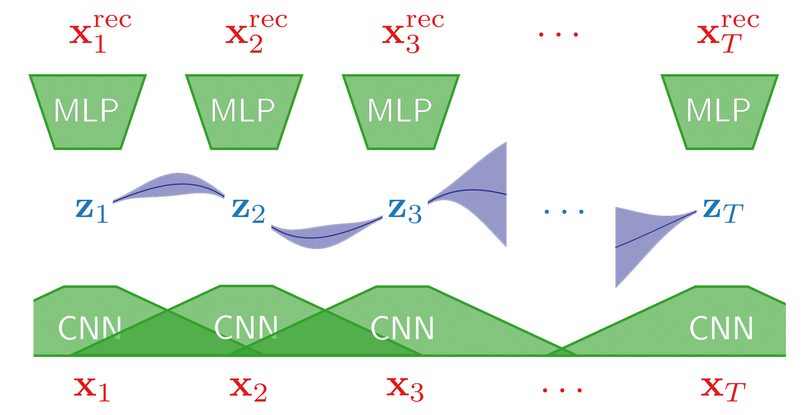

# GP-VAE: Deep Probabilistic Time Series Imputation

Code for [paper](http://arxiv.org/abs/1907.04155)

## Overview
Our approach utilizes non-autoregressive Variational Autoencoders with Gaussian Process prior for time series imputation. 

* The inference model takes time series with missingness and predicts variational parameters for multivariate Gaussian variational distribution.

* The Gaussian Process prior encourages latent representations to capture the temporal correlations in data.

* The generative model takes the sample from posterior approximation and reconstructs the original time series with imputed missing values.  

## Dependencies

* Python >= 3.6
* TensorFlow = 1.14
* Some more packages: see `requirements.txt`

## Run
1. Clone or download this repo. `cd` yourself to it's root directory.
2. Grab or build a working python enviromnent. [Anaconda](https://www.anaconda.com/) works fine.
3. Install dependencies, using `pip install -r requirements.txt`
4. Download data: 'bash data/load_{hmnist, sprites, physionet}.sh'.
5. Run command `CUDA_VISIBLE_DEVICES=* python train.py --model_type {vae, hi-vae, gp-vae} --data_type {hmnist, sprites, physionet} --exp_name <your_name> ...`
   
   To see all available flags run: `python train.py --help`

## Reproducibility

We provide a set of hyperparameters used in our final runs. Some flags have common values for all datasets by default. For reproducibility of reported results run:
  * HMNIST: `python train.py --model_type gp-vae --data_type hmnist --exp_name reproduce_hmnist --seed $RANDOM --testing --banded_covar
    --latent_dim 256 --encoder_sizes=256,256 --decoder_sizes=256,256,256 --window_size 3 --sigma 1 --length_scale 2 --beta 0.8 --num_epochs 20`
  * SPRITES: `python train.py --model_type gp-vae --data_type sprites --exp_name reproduce_sprites --seed $RANDOM --testing --banded_covar
    --latent_dim 256 --encoder_sizes=32,256,256 --decoder_sizes=256,256,256 --window_size 3 --sigma 1 --length_scale 2 --beta 0.1 --num_epochs 20`
  * Physionet: `python train.py --model_type gp-vae --data_type physionet --exp_name reproduce_physionet --seed $RANDOM --testing --banded_covar
    --latent_dim 35 --encoder_sizes=128,128 --decoder_sizes=256,256 --window_size 24 --sigma 1.005 --length_scale 7 --beta 0.2 --num_epochs 40`
  
